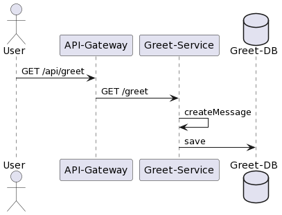

# Spring Boot Opentelemetry Exaple



## Opentelemetry Agent

### Properties

*Disabling* all Micrometer metrics and use Opentelemetry
`-Dotel.instrumentation.micrometer.enabled=false`

Use *only* Micrometer metrics, but also disables tra
```
-Dotel.instrumentation.common.default-enabled=false
-Dotel.instrumentation.micrometer.enabled=true
-Dotel.instrumentation.spring-boot-actuator-autoconfigure.enabled=true
```
